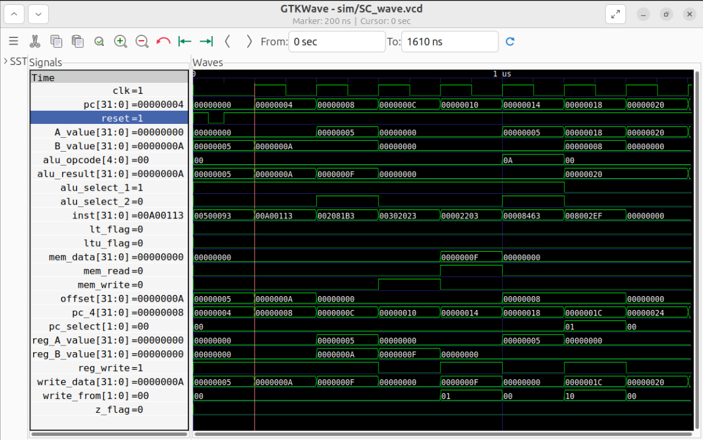

# RISC-V SINGLE-CYCLE

This repository contains a RTL implementation of a single-cycle RISC-V RV32I processor core, designed and verified at the architectural level.

The project focuses on correct instruction semantics, clean datapath/control separation, and deterministic single-cycle execution.

# Overview
**ISA**: RISC-V RV32I
**Microarchitecture**: Single-cycle
**Language**: SystemVerilog
**Verification**: Verilator + GTKWave
**Execution model**: One instruction completed per clock cycle
This core is intended as a baseline architectural reference and a foundation for future extensions (multi-cycle, pipelined, MMU/Linux-capable designs).

# Supported Instruction Set (RV32I)
**R-Type**

    ADD, SUB
    
    AND, OR, XOR
    
    SLT, SLTU
    
    Shift operations

**I-Type**

    ADDI, ANDI, ORI
    
    Shift immediates
  
    JALR

**Load / Store**

    LW
    
    SW

**Branch**

    BEQ, BNE
    
    BLT, BGE
    
    BLTU, BGEU

**Jump**

    JAL
    
    JALR

All instructions execute in one clock cycle, with architectural state updated on the clock edge.

# Verification Status

Verified using Verilator for cycle-accurate simulation

Functional correctness validated using GTKWave

Instruction execution confirmed via waveform inspection:

  PC sequencing
  
  Register updates
  
  Memory behavior
  
  Branch and jump control flow

This project is functionally complete as a single-cycle RV32I core.

# Next Steps

This repository represents a completed single-cycle implementation.

Future work will proceed by forking this design to implement:

Multi-cycle execution

Pipelining

Hazard handling

Memory management (MMU)

This core serves as the architectural and RTL foundation for those extensions.

