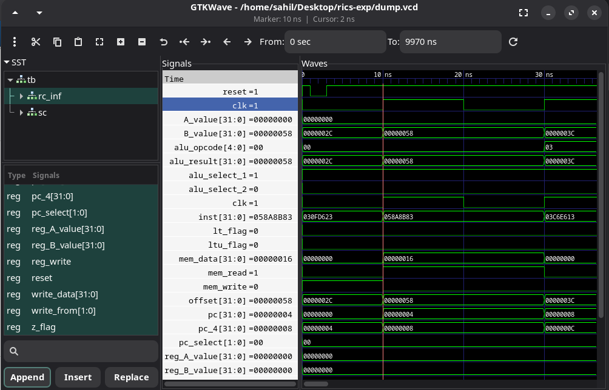

# RISC-V Single-Cycle Processor (RV32I)

A complete RTL implementation of a single-cycle RISC-V RV32I processor core,
designed and verified using SystemVerilog.


## Overview

This project implements a single-cycle RV32I core with clean datapath/control
separation. Every instruction completes in one clock cycle, with architectural
state updated on the rising clock edge. It serves as a baseline reference and
foundation for future pipelined/multi-cycle extensions.

## Supported Instructions

| Type       | Instructions                                |
|------------|---------------------------------------------|
| R-Type     | ADD, SUB, AND, OR, XOR, SLT, SLTU, shifts   |
| I-Type     | ADDI, ANDI, ORI, shift immediates, JALR     |
| Load/Store | LW, SW                                      |
| Branch     | BEQ, BNE, BLT, BGE, BLTU, BGEU              |
| Jump       | JAL, JALR                                   |

## Repository Structure
```bash
rics-exp
├── rtl/       # Synthesizable SystemVerilog source files
├── tb/        # Testbench files
├── sw/        # Software test programs
└── image.png  # Waveform output
```

## How to Run

**Requirements:** Verilator, GTKWave

```bash
# Clone the repo
git clone https://github.com/SahilKrishna-vlsi/rics-exp.git
cd rics-exp

# Compile with Verilator
verilator --cc --exe --build rtl/*.sv tb/*.sv

# View waveforms
gtkwave dump.vcd
```

## Verification

- Cycle-accurate simulation using Verilator
- Waveform inspection via GTKWave
- Validated: PC sequencing, register file updates, memory reads/writes,
  branch and jump control flow

## Waveform Output



## Future Work

- Multi-cycle execution
- 5-stage pipeline with hazard handling
- MMU support for Linux capability
- Working UVM Testbench

## Author

**Sahil Krishna** | [LinkedIn](https://www.linkedin.com/in/sahilkrishna/) |
[GitHub](https://github.com/SahilKrishna-vlsi)

